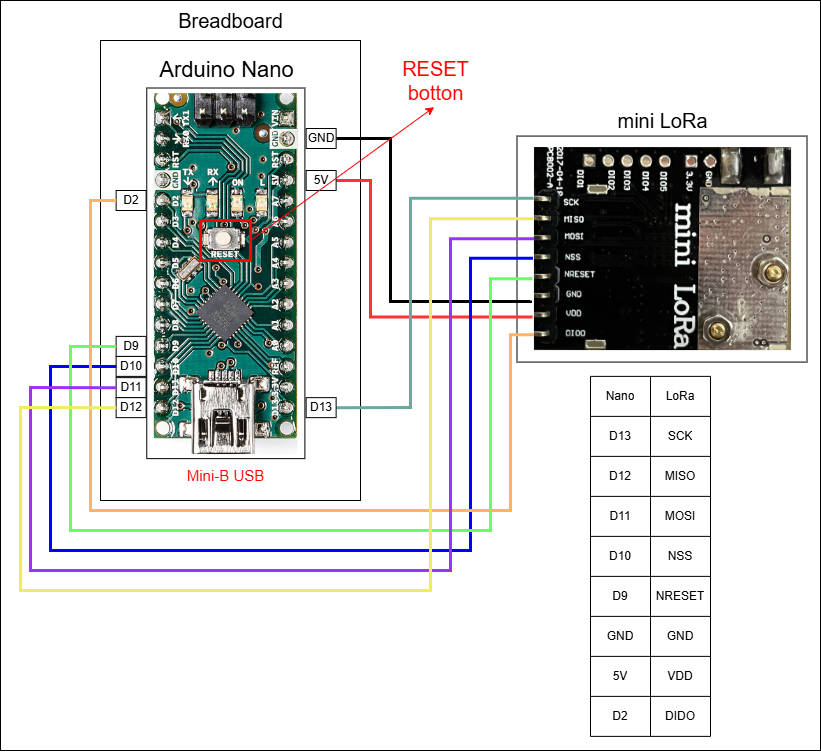
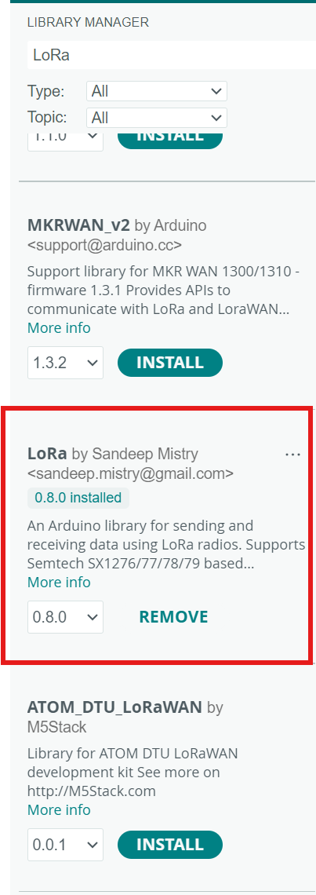
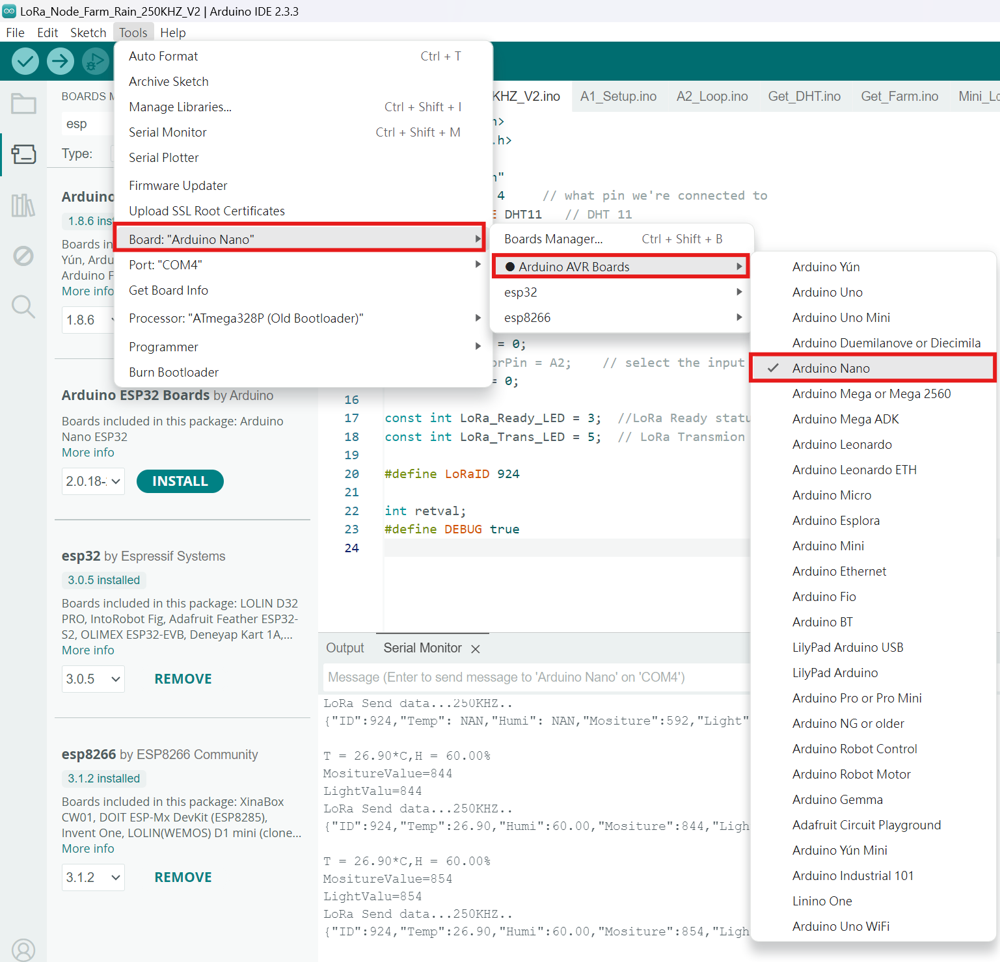
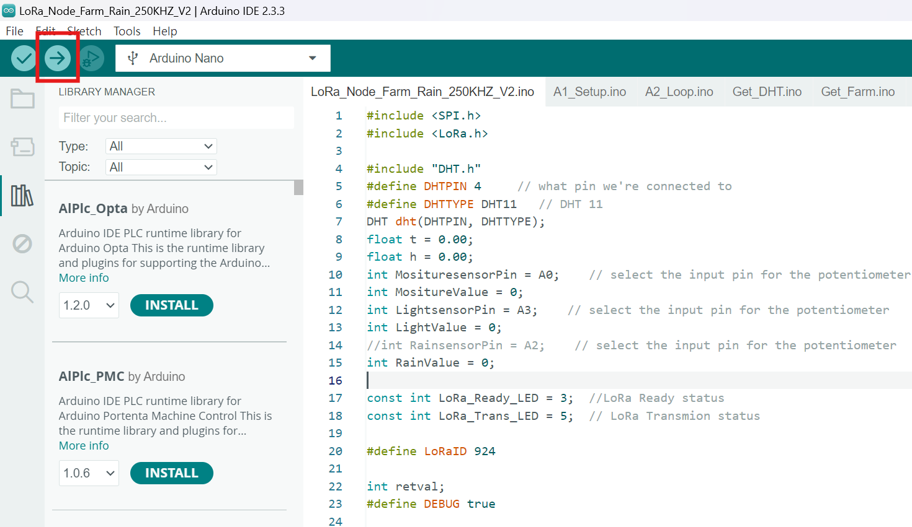
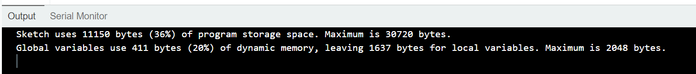
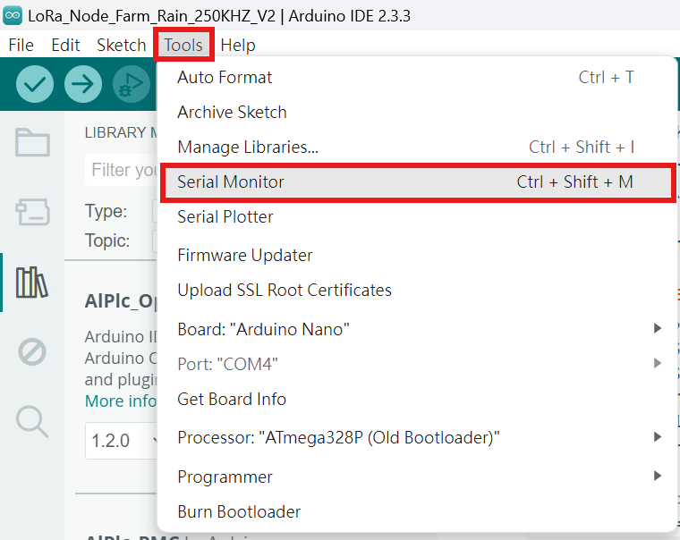
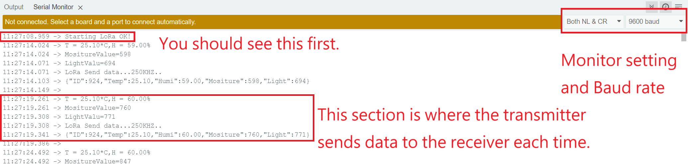
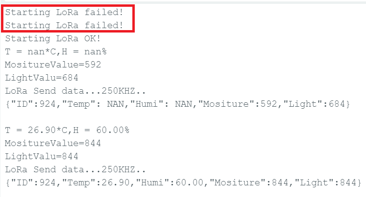

# 1131LoRa
Reference for miniLoRa nodes test. 
Arduino Nano pinout https://www.electronicshub.org/arduino-nano-pinout/
Arduino Nano supports three different types of communication interfaces. They are:
Serial: Tx, Rx 
SPI: miniLoRa module

# Arduino Nano Using Median Filter to Display DHT22 and RTC (Reference)
https://projecthub.arduino.cc/VE1DX/arduino-nano-using-median-filter-to-display-dht22-and-rtc-f725d2
# Interfacing and Displaying Images on OLED
https://projecthub.arduino.cc/najad/interfacing-and-displaying-images-on-oled-08b4f2
# 1.3" OLED module - I2C, 4-pin ((GND VCC SCL SDA)
[TAIWAN IOT OLED](https://www.taiwaniot.com.tw/product/1-3%e5%90%8boled-%e6%b6%b2%e6%99%b6%e5%b1%8f%e9%a1%af%e7%a4%ba%e6%a8%a1%e7%b5%84/)  

site:
https://blog.jmaker.com.tw/arduino-sh1106-oled/  
Library:
https://github.com/wonho-maker/Adafruit_SH1106  
# OLED Library support 
[Supported devices (SSD1325, ST7565, ST7920, UC1608, UC1610, UC1701, PCD8544, PCF8812, KS0108, LC7981, SBN1661, SSD1306, SH1106, T6963, LD7032)] https://github.com/olikraus/u8glib
# What are LoRa® and LoRaWAN®?
https://lora-developers.semtech.com/documentation/tech-papers-and-guides/lora-and-lorawan/
# Detail about this hans-on
- We are using LoRa and Arduino to simulate a large farm environment with one transmitter and one receiver.
- So we have two weeks to practice this.
- Material:
- Arduino nano board, mini LoRa board DHT11 sensor and several wire.
## Wiring diagram (Start from transmitter)
  
> [!NOTE]
> Please ensure that the LoRa antenna is installed.
> Ensure your connection is correct so that you can view LoRa link results.

## Build up environment
- First, download arduino
> [!CAUTION]
> - Second, don't forget to download the CH340 driver if your computer hasn't installed it yet.  
> (download CH340 driver) https://www.arduined.eu/ch340-windows-10-driver-download/  
> (how to install) https://forum.arduino.cc/t/how-to-install-ch340-driver-for-windows-11/1154087  

## Include Arduino library 
- We have 2 library need to include.
- 1. LoRa library
- 2. DHT sensor library  

  
### IDE setting
* Find nano board from tool -> board -> Arduino AVR boards -> Arduino nano
  
* Find the right port from device manager
  
> [!CAUTION]
> If your device manager tells you the port is USB Serial(COMX) instead of CH340
> That means this nano is broken, please change another nano board.

### Uplaod the code
- After finish those setting, you can verify code and upload to nano.
  
## See result(Transmitter)
* Your upload would be like this.
  
* Open Serial Monitor  
  
* Follow monitor setting
* Correct result would be like this.
* Also your nano will blink when data trasmit.
  
> [!CAUTION]
> If your monitor show this.  
>   
> Please press the reset botton on the nano few times until starting OK, otherwise check your wire connection, it should be wrong at somewhere.

## Wiring diagram (receiver)
  
> [!NOTE]
> Please ensure that the LoRa antenna is installed.
> Ensure your connection is correct so that you can view LoRa link results.

## Build up environment
- We have 3 library need to include.
- 1. LoRa library
- 2. Adafruit GFX library
  
- 3. Adafruit_SH1106 library
> [!NOTE]
> This libray is special one, you can't find it on library manager.
> We have to download on internet.
> https://github.com/wonho-maker/Adafruit_SH1106
>   
> Unzip the file
>   
> Usually, Arduino's library file is in C:\Users\user\Documents\Arduino
